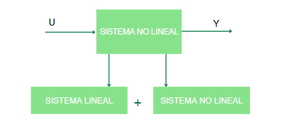
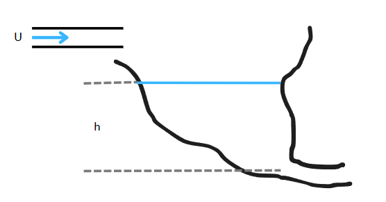
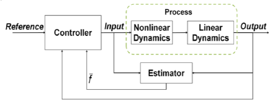

# CLASE 3 III CORTE

# **ADRC: Active Disturbance Rejection Control**

**ADRC** (Active Disturbance Rejection Control) es una técnica de control propuesta por **Zhiqiang Gao** como alternativa al clásico **PID**. Esta técnica busca resolver los problemas del control PID, tales como:

- Control de sistemas no lineales.
- Mejora de la velocidad de respuesta.
- Control preciso de la ubicación de polos.

ADRC fue introducida alrededor de 2011 y está ganando popularidad, especialmente en **control de movimiento** (debido a su rápida respuesta) y **sistemas eléctricos**, donde es vital rechazar perturbaciones rápidamente para evitar daños a los componentes. También se utiliza en **sistemas eólicos**.

---

## Fundamentos del ADRC

ADRC es una técnica basada en el **espacio de estados**, que utiliza un **observador de estados extendido (ESO)** para estimar:

- Estados de la planta.
- Perturbaciones internas y externas.
- Dinámicas no lineales no modeladas.

Esto permite **rechazar perturbaciones** sin necesidad de modelos matemáticos complejos. Solo es necesario conocer:

- El **orden del sistema**.
- La **ganancia crítica o nominal**.

Por ejemplo, en un sistema no lineal, se puede modelar la parte lineal y dejar que el **ESO** se encargue de la no linealidad. Esto hace que ADRC sea **robusto** y adaptable a cambios en la planta.

---

## Características del ADRC

- El controlador puede comportarse como un **sistema integrador** (sin incluir acción integral explícita), eliminando el **error en estado estacionario** al tratarlo como una perturbación más.
- Inicialmente propuesto como un **controlador lineal (proporcional)**, pero puede extenderse a un controlador **no lineal** para manejar sistemas con no linealidades fuertes.

---

## Componentes del ADRC

1. **Generador de trayectorias**: Modelo matemático que representa la cinemática del sistema y perfiles de movimiento.
2. **Observador de estado extendido (ESO)**:
   - Estima estados, perturbaciones, errores y no linealidades.
3. **Controlador proporcional por retroalimentación de estados**.

---

## Ejemplo: Sistema No Lineal

El 99% de los sistemas físicos son no lineales. Sin embargo, estos sistemas se pueden descomponer en una parte lineal y una parte no lineal. A continuación, se presenta el caso de un tanque cuya área de sección transversal varía en función de la altura, debido a sus paredes irregulares. Para determinar cómo varía el área respecto a la altura, es necesario conocer la forma del tanque y establecer una función matemática que describa esta relación.

En el contexto de ADRC, es posible considerar \(1/A(h)\) como una constante, permitiendo así rechazar la no linealidad. Esta no linealidad es estimada y compensada por el **observador de estado extendido (ESO)**.

  

**Ecuaciones del sistema**

$$
\frac{d}{dt} \left( \int_0^h A(h)dh \right) = u - a\sqrt{2gh}
$$

$$
A(h)\dot{h} = u - a\sqrt{2gh}
$$

$$
\dot{h} = \frac{1}{A(h)}u - \frac{a\sqrt{2gh}}{A(h)}
$$

**Modelo lineal**

$$
\dot{h} = Ku + h
$$

---

# **NADRC: Nonlinear ADRC**

## Sistema y Modelo en Espacio de Estados

**Modelo de un sistema**

$$
\ddot{y} = -a_1 \dot{y} - a_0 y + bu
$$

**En espacio de estados**

$$
\begin{cases}
\dot{x}_1 = x_2 \\
\dot{x}_2 = -a_0 x_1 - a_1 x_2 + bu + w \\
y = x_1
\end{cases}
$$

**Suponiendo**

$$
f = -a_0 x_1 - a_1 x_2 + (b - b_0)u + w
$$

**Sustituyendo $f$ en espacio de estados:**

$$
\begin{cases}
\dot{x}_1 = x_2 \\
\dot{x}_2 = f + b_0u \\
y = x_1
\end{cases}
$$

**Como $f$ es desconocida, se asigna a un estado:**

$$
\begin{cases}
\dot{x}_1 = x_2 \\
\dot{x}_2 = x_3 + b_0u \\
\dot{x}_3 = h \\
y = x_1
\end{cases}
$$

En **NADRC**, se introducen conceptos adicionales:  

- $(a_{0}, a_{1})$: Parámetros físicos del sistema.
- \( b \): Ganancia crítica o nominal.
- \( w \): Perturbaciones.
- \( f \): Función no lineal.

El **ESO** estima los estados al comparar la salida real del sistema con la salida del modelo matemático. La diferencia es el **error de estimación**, que se corrige mediante retroalimentación para eliminar errores en estado estacionario. Si la planta cambia, el observador ajusta la estimación automáticamente.

### Consideraciones

- Las funciones en NADRC pueden ser complejas, ya que deben modelar la dinámica de las perturbaciones.  
- **No es común** usar funciones complicadas a menos que el sistema tenga **no linealidades muy fuertes**.

$$
\begin{cases}
\dot{z}_1 = z_2 - \beta_1 \gamma_1(e) \\
\dot{z}_2 = z_3 + b_0 u - \beta_2 \gamma_2(e) \\
\dot{z}_3 = -\beta_3 \gamma_3(e) \\
e = z_1 - y
\end{cases}
$$

$$
u = \frac{u_0 - z_3}{b_0}
$$

**Sistema controlado:**

$$
\begin{cases}
\dot{x}_1 = x_2 \\
\dot{x}_2 = u_0 \\
y = x_1
\end{cases}
\quad \text{Libre de perturbaciones y comportamiento integrador}
$$

---

# **LADRC: Linear ADRC**

En **LADRC** (Linear ADRC):

- El **observador** no requiere una función compleja, sino solo **constantes**.
- Se deben calcular los coeficientes:
  - $(K_{1}, K_{2})$ (Controlador)
  - $(L_{1}, L_{2}, L_{3})$ (Observador)

Esto **reduce la complejidad** del sistema.

---

## Diseño del LADRC

1. El **observador de estados** se implementa sumando:
   - El modelo del sistema.
   - La matriz de ganancias de retroalimentación multiplicada por el error de estimación.
2. El modelo se puede obtener mediante:
   - Curva de reacción del proceso.
   - Herramientas de estimación de estados en MATLAB.
   - Aproximación del tiempo muerto para simplificar a un sistema de **segundo orden** (mínimo dos estados).

$$
u_0 = k_1 \, \text{fal}(r_1 - z_1, \alpha_1, \delta) + k_2 \, \text{fal}(r_1 - z_2, \alpha_2, \delta)
$$

$$
\text{fal}(\tilde{e}, \alpha_i, \delta) =
\begin{cases}
\frac{\tilde{e}}{\delta^{1 - \alpha_i}}, & \text{si } |\tilde{e}| \leq \delta \\
|\tilde{e}|^{\alpha_i} \, \text{sign}(\tilde{e}), & \text{si } |\tilde{e}| > \delta
\end{cases}
$$

**Observador de estados extendido lineal**

$$
\begin{cases}
\dot{z}_1 = z_2 + L_1 e \\
\dot{z}_2 = z_3 + b_0 u + L_2 e \\
\dot{z}_3 = L_3 e \\
e = y - z_1
\end{cases}
\quad
\begin{cases}
\dot{x}_1 = x_2 \\
\dot{x}_2 = x_3 + b_0 u \\
\dot{x}_3 = h \\
y = x_1
\end{cases}
$$

**La acción de control sería:**

$$
u_0 = k_1 (\tilde{r} - z_1) - k_2 z_2
$$

**Donde** $\xi(t)$ **se define como la perturbación generalizada, de tipo aditivo:**

$$
y^{(n)} = \kappa(x) \, u(t) + \xi(t)
$$

### Observador de Estados

- **Ecuación de estado**  
  $x_{k+1} = A \cdot x_k + B \cdot u_k$

- **Ecuación del observador**  
  $\hat{x}_{k+1} = A \cdot \hat{x}_k + B \cdot u_k + L \cdot (y_k - \hat{y}_k)$

Estimación basada en modelo → $A \cdot \hat{x}_k + B \cdot u_k$  
Actualización con el error medido → $L \cdot (y_k - \hat{y}_k)$

#### Representación del sistema extendido:

$$
A_{Ob} = A - L \cdot C
$$

$$
B_{Ob} = \begin{bmatrix} B & L \end{bmatrix}
$$

$$
C_{Ob} = I_{n \times n}
$$

$$
D_{Ob} = \begin{bmatrix} 0_{n \times m} & 0_{n \times p} \end{bmatrix}
$$

Donde:

- $n$: número de estados  
- $m$: número de entradas  
- $p$: número de salidas

- **Ecuación de estado**

  $x_{k+1}=A\cdot x_k + B\cdot u_k$

- **Ecuación del Observador**

  $\hat{x}_{k+1} = A\cdot \hat{x}_k + B\cdot u_k + L\cdot (y_k - \hat{y}_k)$

  - **Estimación basada en modelo**
  - **Actualización con el error medido**

### Estimación de Perturbaciones

- Se añade un estado adicional \( d \) para estimar las perturbaciones.
- La matriz del sistema se extiende para incluir \( d \).

#### Sistema Discreto con Perturbación

$$
\begin{cases}
x_{k+1} = A \cdot x_k + B \cdot u_k + F \cdot d_k \\
y_k = C \cdot x_k
\end{cases}
$$

#### Si la perturbación es constante:

$$
d(k+1) = d(k)
$$

Entonces se puede redefinir el sistema extendido como:

$$
\begin{bmatrix}
x(k+1) \\
d(k+1)
\end{bmatrix}
= x_a(k+1) = 
\begin{bmatrix}
A & F \\
0 & I
\end{bmatrix}
x_a(k) +
\begin{bmatrix}
B \\
0
\end{bmatrix}
u(k)
$$

$$
y(k) = [C \quad 0] \cdot x_a(k)
$$

- Ahora es posible diseñar un **observador de estados** que también estime la perturbación.
- Esta estimación permite aplicar una **prealimentación** para compensar la perturbación.

---

### Ubicación de Polos

Los coeficientes $\lambda$ se aplican a los estados con error. Esto genera un **polinomio característico** que debe cumplir:

- Hacer que el error tienda a cero rápidamente.
- Asegurar **estabilidad** (polos con parte real negativa).
- Ubicar polos más a la izquierda para **mayor rapidez**.
- Evitar partes imaginarias grandes para **reducir oscilaciones**.

---

### Representación en Espacio de Estados

$$
y^{(n)}(t) = u(t) + \xi(t)
$$

$$
\dot{x} = 
\underbrace{
\begin{bmatrix}
0 & 1 & 0 & \cdots & 0 \\
0 & 0 & 1 & \cdots & 0 \\
0 & 0 & 0 & \ddots & 0 \\
\vdots & \vdots & \vdots & \ddots & 1 \\
0 & 0 & 0 & \cdots & 0
\end{bmatrix}
}_{A}
x +
\underbrace{
\begin{bmatrix}
0 \\
0 \\
\vdots \\
0 \\
1
\end{bmatrix}
}_{B}
(u(t) + \xi(t))
$$

$$
x = 
\begin{bmatrix}
x_1 \\
x_2 \\
x_3 \\
\vdots \\
x_n
\end{bmatrix}, \quad
\dot{x} = 
\begin{bmatrix}
\dot{x}_1 \\
\dot{x}_2 \\
\dot{x}_3 \\
\vdots \\
\dot{x}_n
\end{bmatrix}
$$

$$
y = 
\underbrace{
\begin{bmatrix}
1 & 0 & 0 & \cdots & 0
\end{bmatrix}
}_{C}
x
$$

Matrices canónicas:

$$
A = 
\begin{bmatrix}
0 & 1 & 0 & \cdots & 0 \\
0 & 0 & 1 & \cdots & 0 \\
\vdots & \vdots & \vdots & \ddots & \vdots \\
0 & 0 & 0 & \cdots & 1 \\
0 & 0 & 0 & \cdots & 0
\end{bmatrix}, \quad
B = 
\begin{bmatrix}
0 \\
0 \\
\vdots \\
0 \\
1
\end{bmatrix}, \quad
C = [1 \quad 0 \quad 0 \quad \cdots \quad 0]
$$

---

### Observador de Luenberger para ADRC

#### Estimación del Error

$$
\tilde{e}_y = y - \hat{y}
$$

#### Ecuación del Observador

$$
\dot{\hat{x}}_\xi = 
A_\xi \cdot \hat{x}_\xi + 
B_\xi \cdot u + 
\lambda_\xi \cdot \tilde{e}_y(t)
$$

#### Matrices del Observador

$$
A_\xi = 
\begin{bmatrix}
0_{(n+m) \times 1} & I_{(n+m-1)\times(n+m-1)} \\
0 & 0_{1 \times (n+m-1)}
\end{bmatrix}
$$

$$
B_\xi = 
\begin{bmatrix}
0 \\
0 \\
\vdots \\
1
\end{bmatrix}, \quad
C_\xi = [1 \quad 0 \quad \cdots \quad 0]
$$

$$
\lambda_\xi =
\begin{bmatrix}
\lambda_{n+m-1} \\
\lambda_{n+m-2} \\
\vdots \\
\lambda_0
\end{bmatrix}
$$

---

###  Dinámica del Error de Estimación

Al restar las ecuaciones, se define el polinomio característico de la dinámica del error:

$$
\tilde{e}_y^{(n+m)} + \lambda_{n+m-1}\tilde{e}_y^{(n+m-1)} + \cdots + \lambda_1\dot{\tilde{e}}_y + \lambda_0\tilde{e}_y = \xi^{(m)}(t)
$$

#### Polinomio Característico

$$
p(s) = s^{n+m} + \lambda_{n+m-1}s^{n+m-1} + \cdots + \lambda_1 s + \lambda_0
$$

- Se seleccionan los \( \lambda_i \) para que todos los polos estén en el semiplano izquierdo → **Polinomio de Hurwitz**.

---

### Estimación de la Perturbación Generalizada

Se asume que la perturbación puede modelarse como un polinomio en el tiempo:

$$
\xi(t) = k_0 + k_1 t + k_2 t^2 + \cdots + k_m t^m + r(t)
$$

- Donde \( r(t) \) es el residuo.
- Si se asume que \( \hat{\xi}^{(m)}(t) = 0 \), entonces es posible construir un observador para las derivadas de la salida y la perturbación.

---

---

