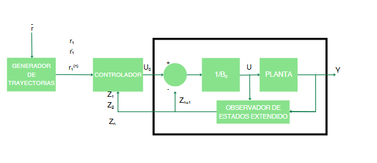

# CLASE 3 III CORTE

# **ADRC: Active Disturbance Rejection Control**

**ADRC** (Active Disturbance Rejection Control) es una técnica de control propuesta por **Zhiqiang Gao** como alternativa al clásico **PID**. Esta técnica busca resolver los problemas del control PID, tales como:

- Control de sistemas no lineales.
- Mejora de la velocidad de respuesta.
- Control preciso de la ubicación de polos.

ADRC fue introducida alrededor de 2011 y está ganando popularidad, especialmente en **control de movimiento** (debido a su rápida respuesta) y **sistemas eléctricos**, donde es vital rechazar perturbaciones rápidamente para evitar daños a los componentes. También se utiliza en **sistemas eólicos**.

---

## Fundamentos del ADRC

ADRC es una técnica basada en el **espacio de estados**, que utiliza un **observador de estados extendido (ESO)** para estimar:

- Estados de la planta.
- Perturbaciones internas y externas.
- Dinámicas no lineales no modeladas.

Esto permite **rechazar perturbaciones** sin necesidad de modelos matemáticos complejos. Solo es necesario conocer:

- El **orden del sistema**.
- La **ganancia crítica o nominal**.

Por ejemplo, en un sistema no lineal, se puede modelar la parte lineal y dejar que el **ESO** se encargue de la no linealidad. Esto hace que ADRC sea **robusto** y adaptable a cambios en la planta.

---

## Características del ADRC

- El controlador puede comportarse como un **sistema integrador** (sin incluir acción integral explícita), eliminando el **error en estado estacionario** al tratarlo como una perturbación más.
- Inicialmente propuesto como un **controlador lineal (proporcional)**, pero puede extenderse a un controlador **no lineal** para manejar sistemas con no linealidades fuertes.

---

## Componentes del ADRC

1. **Generador de trayectorias**: Modelo matemático que representa la cinemática del sistema y perfiles de movimiento.
2. **Observador de estado extendido (ESO)**:
   - Estima estados, perturbaciones, errores y no linealidades.
3. **Controlador proporcional por retroalimentación de estados**.

---

## Ejemplo: Sistema No Lineal

El 99% de los sistemas físicos son no lineales. Sin embargo, estos sistemas se pueden descomponer en una parte lineal y una parte no lineal. A continuación, se presenta el caso de un tanque cuya área de sección transversal varía en función de la altura, debido a sus paredes irregulares. Para determinar cómo varía el área respecto a la altura, es necesario conocer la forma del tanque y establecer una función matemática que describa esta relación.

En el contexto de ADRC, es posible considerar \(1/A(h)\) como una constante, permitiendo así rechazar la no linealidad. Esta no linealidad es estimada y compensada por el **observador de estado extendido (ESO)**.

  

**Ecuaciones del sistema**

$$
\frac{d}{dt} \left( \int_0^h A(h)dh \right) = u - a\sqrt{2gh}
$$

$$
A(h)\dot{h} = u - a\sqrt{2gh}
$$

$$
\dot{h} = \frac{1}{A(h)}u - \frac{a\sqrt{2gh}}{A(h)}
$$

**Modelo lineal**

$$
\dot{h} = Ku + h
$$

---

# **NADRC: Nonlinear ADRC**

## Sistema y Modelo en Espacio de Estados

**Modelo de un sistema**

$$
\ddot{y} = -a_1 \dot{y} - a_0 y + bu
$$

**En espacio de estados**

$$
\begin{cases}
\dot{x}_1 = x_2 \\
\dot{x}_2 = -a_0 x_1 - a_1 x_2 + bu + w \\
y = x_1
\end{cases}
$$

**Suponiendo**

$$
f = -a_0 x_1 - a_1 x_2 + (b - b_0)u + w
$$

**Sustituyendo $f$ en espacio de estados:**

$$
\begin{cases}
\dot{x}_1 = x_2 \\
\dot{x}_2 = f + b_0u \\
y = x_1
\end{cases}
$$

**Como $f$ es desconocida, se asigna a un estado:**

$$
\begin{cases}
\dot{x}_1 = x_2 \\
\dot{x}_2 = x_3 + b_0u \\
\dot{x}_3 = h \\
y = x_1
\end{cases}
$$

En **NADRC**, se introducen conceptos adicionales:  

- $(a_{0}, a_{1})$: Parámetros físicos del sistema.
- \( b \): Ganancia crítica o nominal.
- \( w \): Perturbaciones.
- \( f \): Función no lineal.

El **ESO** estima los estados al comparar la salida real del sistema con la salida del modelo matemático. La diferencia es el **error de estimación**, que se corrige mediante retroalimentación para eliminar errores en estado estacionario. Si la planta cambia, el observador ajusta la estimación automáticamente.

### Consideraciones

- Las funciones en NADRC pueden ser complejas, ya que deben modelar la dinámica de las perturbaciones.  
- **No es común** usar funciones complicadas a menos que el sistema tenga **no linealidades muy fuertes**.

$$
\begin{cases}
\dot{z}_1 = z_2 - \beta_1 \gamma_1(e) \\
\dot{z}_2 = z_3 + b_0 u - \beta_2 \gamma_2(e) \\
\dot{z}_3 = -\beta_3 \gamma_3(e) \\
e = z_1 - y
\end{cases}
$$

$$
u = \frac{u_0 - z_3}{b_0}
$$

**Sistema controlado:**

$$
\begin{cases}
\dot{x}_1 = x_2 \\
\dot{x}_2 = u_0 \\
y = x_1
\end{cases}
\quad \text{Libre de perturbaciones y comportamiento integrador}
$$

---

# **LADRC: Linear ADRC**

En **LADRC** (Linear ADRC):

- El **observador** no requiere una función compleja, sino solo **constantes**.
- Se deben calcular los coeficientes:
  - $(K_{1}, K_{2})$ (Controlador)
  - $(L_{1}, L_{2}, L_{3})$ (Observador)

Esto **reduce la complejidad** del sistema.

---

## Diseño del LADRC

1. El **observador de estados** se implementa sumando:
   - El modelo del sistema.
   - La matriz de ganancias de retroalimentación multiplicada por el error de estimación.
2. El modelo se puede obtener mediante:
   - Curva de reacción del proceso.
   - Herramientas de estimación de estados en MATLAB.
   - Aproximación del tiempo muerto para simplificar a un sistema de **segundo orden** (mínimo dos estados).

### Estimación de perturbaciones

- Se añade un estado adicional \( d \) para estimar las perturbaciones.
- La matriz se extiende para incluir \( d \).

$$
u_0 = k_1 \, \text{fal}(r_1 - z_1, \alpha_1, \delta) + k_2 \, \text{fal}(r_1 - z_2, \alpha_2, \delta)
$$

$$
\text{fal}(\tilde{e}, \alpha_i, \delta) =
\begin{cases}
\frac{\tilde{e}}{\delta^{1 - \alpha_i}}, & \text{si } |\tilde{e}| \leq \delta \\
|\tilde{e}|^{\alpha_i} \, \text{sign}(\tilde{e}), & \text{si } |\tilde{e}| > \delta
\end{cases}
$$

---

### Observador de estados extendido lineal

$$
\begin{cases}
\dot{z}_1 = z_2 + L_1 e \\
\dot{z}_2 = z_3 + b_0 u + L_2 e \\
\dot{z}_3 = L_3 e \\
e = y - z_1
\end{cases}
\quad
\begin{cases}
\dot{x}_1 = x_2 \\
\dot{x}_2 = x_3 + b_0 u \\
\dot{x}_3 = h \\
y = x_1
\end{cases}
$$

**La acción de control sería:**

$$
u_0 = k_1 (\tilde{r} - z_1) - k_2 z_2
$$

---

**Donde** $\xi(t)$ **se define como la perturbación generalizada, de tipo aditivo:**

$$
y^{(n)} = \kappa(x) \, u(t) + \xi(t)
$$

---

## Ubicación de Polos

Los coeficientes \( \lambda \) (lambdas) multiplican los estados con error. Esto da lugar a un **polinomio característico** cuyo objetivo es:

- Hacer que el error tienda a cero rápidamente.
- Asegurar **estabilidad** (polos en el semiplano izquierdo).
- Ubicar polos **más a la izquierda** para mayor velocidad.
- Evitar componentes imaginarias para reducir oscilaciones.

---

